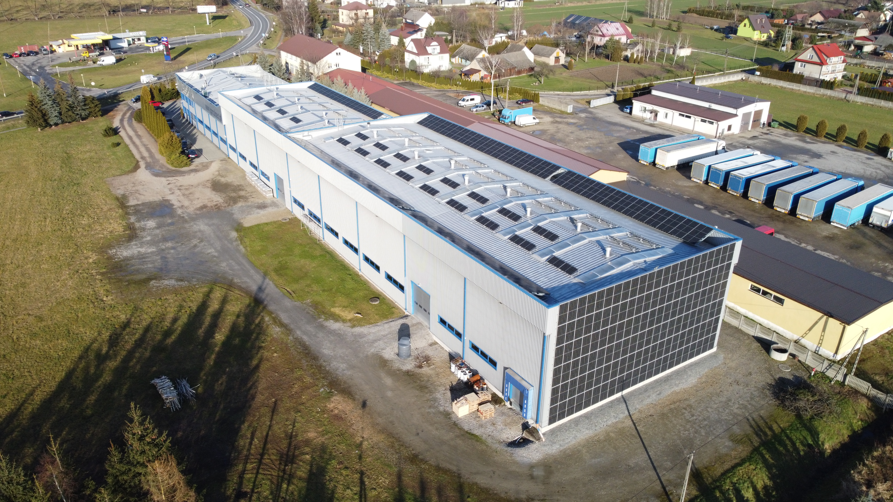
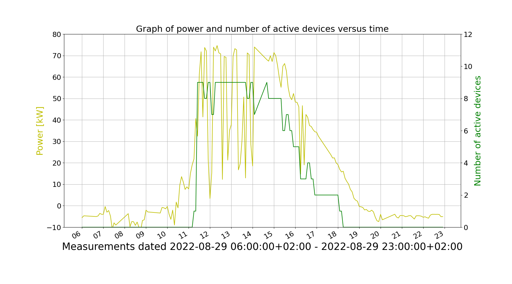
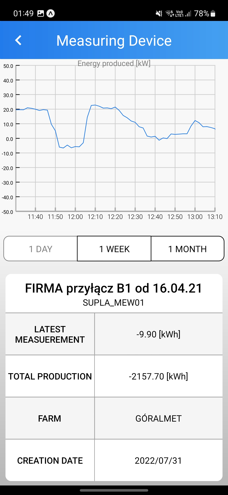
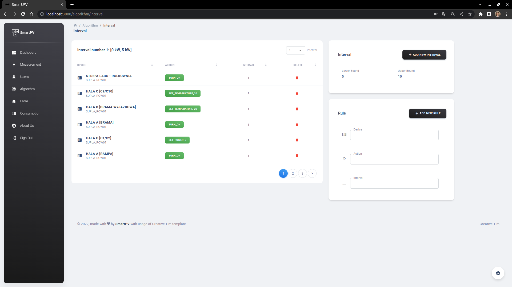

### SmartPV
The project was developed as a part of a bachelor thesis as well as on behalf of a client.
The idea of software is to transform produced by PV farm energy in real time, avoiding expensive storage costs.

### Results

Final product version was successfully delivered on 01.01.2023. Beta version was in use since 01.07.2022 and in 4 months period
was able to **save 10MWh of energy during 4 months period**.

All measurements and summaries are presented in [documentation](docs.pdf)

The project was handed over to the client and is no longer supported by us.

### Product

Project consist of 3 systems:

* **smart-pv-server** - server that manages IoT devices and handles app requests. Java + Spring technology with hexagonal architecture
* **smart-pv-web-app** - web application for admin to manage farms. JS + React
* **smart-pv-mobile-app** - mobile application for customers to track managing results. JS + React Native

### Visuals

_Place where the system was installed_

_Statistics of example day visualisation_ 

_Mobile app example view_

_Web app example view_

### Creators 
* Jakub Janicki - Backend/DevOps Developer
* Adam Przywieczerski - Frontend Developer
